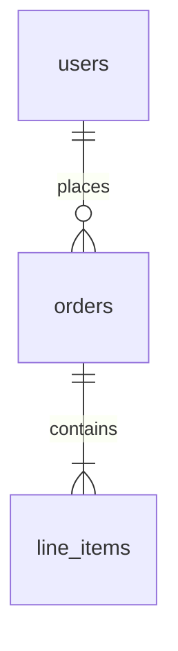

# docan

Markdown to PDF converter with browser preview. Renders mermaid diagrams, GitHub callouts, tables, syntax-highlighted code blocks, and embedded images.

## Install

```bash
npm install
npm link
```

## Usage

```bash
# Preview in browser (open in VS Code Simple Browser: Ctrl+Shift+P → "Simple Browser: Show" → http://localhost:3000)
docan preview docs/rostering/rostering.md

# Preview with dark theme
docan preview docs/rostering/rostering.md --theme dark

# Export to PDF
docan export docs/rostering/rostering.md -o docs/rostering/rostering.pdf

# Export with options
docan export docs/rostering/rostering.md -o output.pdf --theme dark --format Letter
```

### CLI Reference

| Command   | Flag              | Default      | Description                |
|-----------|-------------------|--------------|----------------------------|
| `preview` | `--theme <name>`  | `light`      | `light` or `dark`          |
|           | `--port <number>` | `3000`       | Local server port          |
| `export`  | `-o, --output`    | `<input>.pdf`| Output PDF path            |
|           | `--theme <name>`  | `light`      | `light` or `dark`          |
|           | `--format <size>` | `A4`         | `A4` or `Letter`           |

## Document Workspace

All markdown documents live under `docs/`. Each topic gets its own folder with co-located assets.

```
docs/
├── rostering/
│   ├── rostering.md              ← main document
│   ├── rostering.pdf             ← exported PDF (gitignored)
│   └── state_machine/            ← images used by rostering.md
│       ├── shift_schedule.png
│       ├── roster.png
│       └── swap_request.png
├── another-topic/
│   ├── another-topic.md
│   └── diagrams/
│       └── flow.png
└── ...
```

### Rules

1. **One folder per topic** — keep markdown and its assets together
2. **Relative image paths** — always use relative paths in markdown (e.g., ``), docan resolves them automatically
3. **Run docan from project root** — paths resolve relative to the markdown file location, not your working directory
4. **Export output next to source** — use `-o docs/topic/topic.pdf` to keep PDF alongside its markdown

### Creating a New Document

```bash
# 1. Create folder
mkdir -p docs/my-topic

# 2. Write markdown (use relative paths for images)
# docs/my-topic/my-topic.md

# 3. Preview
docan preview docs/my-topic/my-topic.md

# 4. Export
docan export docs/my-topic/my-topic.md -o docs/my-topic/my-topic.pdf
```

### Supported Markdown Features

- **GitHub Flavored Markdown** — tables, task lists, strikethrough
- **Mermaid diagrams** — fenced code blocks with `mermaid` language. Supports `dir=` attribute to control layout direction (`TB`, `BT`, `LR`, `RL`) and `width=` to constrain width
- **GitHub callouts** — `> [!NOTE]`, `> [!TIP]`, `> [!IMPORTANT]`, `> [!WARNING]`, `> [!CAUTION]`, `> [!HIGHLIGHT]` (grey, no title)
- **Syntax highlighting** — all major languages
- **Images** — PNG, JPG, SVG, GIF, WebP (embedded as base64 in output)
- **Heading anchors** — auto-generated IDs for internal links
- **Page breaks** — insert `<!-- pagebreak -->` anywhere to force a new page in PDF export

```md
## Section One

Some content here.

<!-- pagebreak -->

## Section Two

Starts on a new page in the exported PDF.
```

#### Mermaid Diagram Direction

Use `dir=` to control diagram flow direction — useful for large ERDs and class diagrams that overflow vertically:

````md

````

## Font Behavior

docan uses the OS system font stack — not a bundled font. PDF output font depends on where `docan export` is run:

| Platform | Font used in PDF |
|---|---|
| macOS | **SF Pro** (Apple system font) |
| Windows | Segoe UI |
| Linux | Noto Sans / DejaVu Sans (whichever is installed) |

> Since this tool is optimized for macOS, PDFs are expected to render in **SF Pro**. Running export on Linux/CI will produce different typography.

## Tests

```bash
npm test
```
